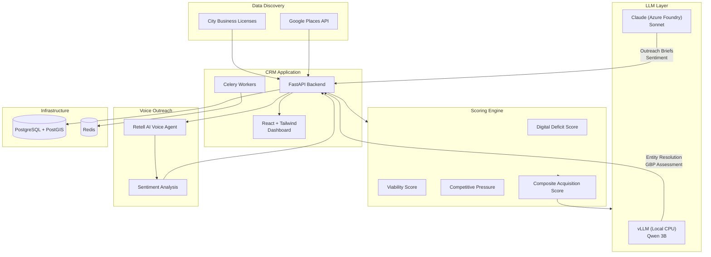

# LeadForge

**Automated lead generation pipeline for hyper-local small businesses in Chicago.**


LeadForge discovers under-digitized small businesses using public data, scores them on acquisition potential through a multi-signal scoring engine, generates personalized outreach using LLMs, and automates initial contact via AI voice calls. A full CRM dashboard tracks every lead from discovery through close.

The system also integrates with municipal grant programs, identifying businesses eligible for facade improvement grants and routing them into a parallel grant application pipeline.

## Architecture



## Features

### Data Pipeline
- Discovers businesses from the Chicago Data Portal with niche-specific queries
- Enriches records with Google Places data (reviews, ratings, website, photos)
- Deduplicates across data sources using LLM-assisted entity resolution
- Stores spatial data in PostGIS for geographic analysis

### Multi-Signal Scoring
- **Digital Deficit** — measures how under-digitized a business is (no website, weak SEO, missing social profiles)
- **Viability** — estimates business health from operating history, reviews, and license status
- **Competitive Pressure** — evaluates market density and competitor ad spend in the business's area
- **Composite Score** — weighted combination that ranks leads by acquisition potential, with automatic price tier assignment

### LLM Integration
- Local CPU inference via vLLM for batch operations (entity resolution, GBP assessment)
- Claude via Azure Foundry for high-quality outreach brief generation and sentiment analysis
- All LLM outputs parsed from structured JSON with fence-stripping

### Automated Voice Outreach
- AI voice calls through Retell AI with personalized talking points from LLM-generated briefs
- Real-time webhook processing for call status, transcripts, and disposition tracking
- Post-call sentiment scoring feeds back into lead scores
- TCPA-compliant call scheduling

### CRM Dashboard
- Kanban pipeline boards for outreach and grant workflows
- Lead ranking tables with multi-column filtering and sorting
- Score history and trend visualization per business
- Role-based access: admin (full write) and viewer (read-only)
- JWT authentication with login page and session management

### Grant Integration
- Identifies businesses eligible for municipal facade improvement grants
- Point-based eligibility scoring with geographic corridor matching
- Financial calculator for grant amounts, owner contributions, and financing requirements
- 13-stage grant application pipeline with document checklist tracking

## Tech Stack

| Layer | Technology |
|-------|-----------|
| Language | Python 3.12+ |
| API Framework | FastAPI |
| ORM | SQLAlchemy 2.0 (async) |
| Database | PostgreSQL 16 + PostGIS |
| Task Queue | Celery + Redis |
| Local LLM | vLLM (CPU) + Qwen 2.5 3B |
| Cloud LLM | Claude Sonnet via Azure Foundry |
| Voice | Retell AI |
| Frontend | React 18 + Tailwind CSS + Recharts |
| Auth | JWT (python-jose) + bcrypt |
| Package Manager | uv |
| Build | hatchling |

## Quick Start

### Prerequisites

- Python 3.12+
- [uv](https://docs.astral.sh/uv/) package manager
- Docker & Docker Compose
- Node.js 18+ (for frontend)

### 1. Clone and install

```bash
git clone https://github.com/crichalchemist/LeadForge.git
cd LeadForge
uv sync --all-extras
```

### 2. Start infrastructure

```bash
docker compose up -d db redis
```

### 3. Configure environment

```bash
cp .env.example .env
# Edit .env with your API keys and generate a JWT secret:
openssl rand -hex 32  # paste into JWT_SECRET_KEY
```

### 4. Run migrations

```bash
uv run alembic upgrade head
```

### 5. Create your first user

```bash
uv run leadforge create-user --email you@example.com --name "Your Name" --role admin
```

### 6. Start the API

```bash
uv run uvicorn leadforge.api.app:app --reload
```

### 7. Start the frontend

```bash
cd frontend
npm install
npm run dev
```

Open [http://localhost:5173](http://localhost:5173) — you'll see the login page.

## Project Structure

```
src/leadforge/
  api/              # FastAPI app, routes, schemas, dependencies
    routes/         # 8 route modules (auth, businesses, leads, pipeline, outreach, grants, reports, health)
    schemas/        # Pydantic v2 request/response models
  auth/             # JWT creation/verification, password hashing
  cli/              # Typer CLI (pipeline, enrich, score, outreach, export, create-user)
  data/             # External data clients (Socrata, NOF corridors)
  db/               # SQLAlchemy models, migrations, session management
  export/           # CSV export
  grants/           # Grant financial calculator
  llm/              # LLM clients (Claude, vLLM) and prompt modules
  pipeline/         # Orchestration (discovery, enrichment, scoring, outreach)
  scoring/          # Scoring algorithms (digital deficit, viability, competitive, composite, NOF eligibility)
  scrapers/         # Google Places client
  tasks/            # Celery tasks (recalibration, corridor refresh)
  voice/            # Retell AI integration and webhook handling

frontend/           # React + Vite + Tailwind CRM dashboard
migrations/         # Alembic migration scripts
tests/              # 158 tests (API, unit, integration)
docs/               # ADRs, specs, internal documentation
```

## API Overview

| Route Group | Endpoints | Description |
|-------------|-----------|-------------|
| `/auth` | 4 | Login, token refresh, logout, user profile |
| `/businesses` | 3 | List, detail, and update businesses |
| `/leads` | 2 | Ranked lead list and score history |
| `/pipeline` | 2 | Kanban board and stage transitions |
| `/outreach` | 4 | Outreach history, detail, transcript, update |
| `/grants` | 9 | Grant CRUD, stage transitions, documents, financials, board |
| `/reports` | 3 | Funnel, score distribution, zip performance |
| `/health` | 1 | Health check |

All routes except `/health`, `/auth/login`, and webhooks require JWT authentication.
Write operations require admin role.

## Testing

```bash
uv run python -m pytest tests/ -v
```

158 tests across API endpoint tests, unit tests for all scoring algorithms, and integration tests for the discovery pipeline.

## License

MIT
