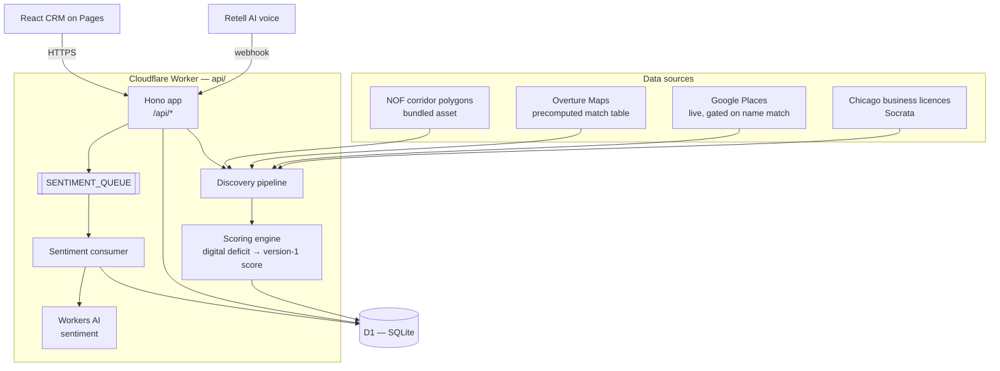

# LeadForge

**Automated lead generation pipeline for hyper-local small businesses in Chicago.**

[](https://github.com/crichalchemist/LeadForge/actions/workflows/ci.yml)


LeadForge discovers under-digitized small businesses from public data, scores them on acquisition potential through a multi-signal scoring engine, generates personalized outreach with LLMs, and automates initial contact via AI voice calls. A CRM dashboard tracks every lead from discovery through close.

The system also integrates with municipal grant programs, identifying businesses eligible for facade improvement grants and routing them into a parallel grant application pipeline.

## Two backends

The project is mid-migration from a self-hosted Python stack to Cloudflare's edge platform. Both live on `main`.

| | Legacy (`src/leadforge/`) | Target (`api/`) |
|---|---|---|
| Role | Reference implementation and behavioral spec | Deployed production API |
| Stack | FastAPI, SQLAlchemy 2 async, PostgreSQL + PostGIS, Celery + Redis, vLLM + Claude | Hono, Zod, D1 (SQLite), Queues, Workers AI, KV |
| Tests | `tests/` (pytest) | `api/test/` (vitest on workerd) |
| Runs | Locally, via Docker Compose | https://leadforge-api.crichalchemist.workers.dev |

The Python code is the specification. When a route or scoring rule is ported, the Python module and its tests define the expected behaviour, and the Workers port is pinned to it by differential test suites for the scoring and name-matching functions.

The React CRM is deployed once, to Pages, and points at the Worker: https://leadforge-frontend-80u.pages.dev

**Not yet ported:** voice call placement (the Retell webhook *is* ported, but nothing on Workers places a call), the enrichment and recalibration queue consumers, the scheduled crons, and the scoring pass that adds viability and competitive pressure — discovery currently writes a version-1 score whose composite is the digital deficit alone, exactly as the Python pipeline's first phase does.

## Architecture


```mermaid
flowchart TB
    subgraph Sources["Data sources"]
        Socrata["Chicago business licences<br/>Socrata"]
        Google["Google Places<br/>live, gated on name match"]
        Overture["Overture Maps<br/>precomputed match table"]
        Corridors["NOF corridor polygons<br/>bundled asset"]
    end

    subgraph Worker["Cloudflare Worker — api/"]
        Hono["Hono app<br/>/api/*"]
        Discovery[Discovery pipeline]
        Scoring["Scoring engine<br/>digital deficit → version-1 score"]
        Queue[["SENTIMENT_QUEUE"]]
        Consumer[Sentiment consumer]
        WAI["Workers AI<br/>sentiment"]
    end

    D1[("D1 — SQLite")]
    Pages[React CRM on Pages]
    Retell[Retell AI voice]

    Socrata --> Discovery
    Google --> Discovery
    Overture --> Discovery
    Corridors --> Discovery
    Discovery --> Scoring
    Scoring --> D1
    Hono --> Discovery
    Hono --> D1
    Retell -->|webhook| Hono
    Hono --> Queue
    Queue --> Consumer
    Consumer --> WAI
    Consumer --> D1
    Pages -->|HTTPS| Hono
```

Identity is the city's licence account (`account_number` + `site_number`), not a third-party place id — so deduplication happens before any billable lookup, and a business whose enrichment failed is never stored twice. See [ADR 030](docs/vault/030-places-composition-licence-identity.md).

## Features

### Data pipeline
- Discovers businesses from the Chicago Data Portal with niche-specific licence queries
- Collapses licence renewals to one row per business on the city's account key, before any paid lookup
- Enriches from Google Places (rating, review count, website, phone) only when the candidate's name corroborates the licence name within 200 m — a false match is worse than no match
- Overlays a precomputed Overture Maps match table for website and social signals Google does not return
- Decides NOF corridor membership by point-in-polygon against a bundled snapshot of the City's corridor layers

### Multi-signal scoring
- **Digital deficit** — how under-digitized a business is (no website, no social presence, weak reviews)
- **Viability** — business health from operating history, reviews, and licence status
- **Competitive pressure** — market density and competitor ad spend in the area
- **Composite** — `0.40 × deficit + 0.35 × viability + 0.25 × pressure`, capped at 100, plus a price tier
- Scores are versioned rows, never overwritten, so every change is auditable

### LLM integration
- On Workers, both a fast and a quality client run on Workers AI. Only the sentiment path is wired up: the Retell webhook enqueues, the consumer analyses the transcript and feeds the score. The outreach-brief and entity-resolution modules are ported and tested but nothing calls them yet
- In Python, vLLM handles batch work (entity resolution, GBP assessment) and Claude handles outreach briefs and sentiment ([ADR 011](docs/vault/011-llm-task-routing.md))
- Every LLM output is parsed from JSON with fence stripping and returns a documented fallback rather than throwing

### Automated voice outreach
- AI voice calls through Retell with talking points from LLM-generated briefs
- Webhook processing for call status, transcripts, and disposition, with HMAC signature verification against the raw body and handlers idempotent on `call_id`
- Post-call sentiment adjusts the composite score multiplicatively, once per call
- TCPA-compliant scheduling

### CRM dashboard
- Kanban boards for the outreach and grant pipelines
- Lead ranking tables with multi-column filtering and sorting
- Score history and trend visualization per business
- Role-based access: `admin` (full write) and `viewer` (read-only), on HS256 JWTs

### Grant integration
- Identifies businesses eligible for municipal facade improvement grants
- Point-based eligibility scoring with a corridor hard gate
- Financial calculator for grant amounts, owner contributions, and financing
- 13-stage grant application pipeline with document checklist tracking

## Tech stack

| Layer | Target (Workers) | Legacy (Python) |
|-------|------------------|-----------------|
| Language | TypeScript 6 | Python 3.12+ |
| API framework | Hono 4 | FastAPI |
| Validation | Zod 4 | Pydantic v2 |
| Database | D1 (SQLite) | PostgreSQL 16 + PostGIS |
| Background work | Queues | Celery + Redis |
| LLM | Workers AI | vLLM (CPU, Qwen2.5 3B) + Claude Sonnet via Azure Foundry |
| Tests | vitest 4 on workerd | pytest |
| Tooling | wrangler 4 | uv, hatchling, ruff, alembic |

Frontend, shared by both: React 18, Vite 6, Tailwind 3, TanStack Query 5, Recharts 2, TypeScript 5.6.
Voice is Retell AI in both. Auth is HS256 JWTs in both.

## Quick start

### Prerequisites

- Python 3.12+ and [uv](https://docs.astral.sh/uv/)
- Node.js 24 (the version CI pins; neither package manifest declares `engines`)
- Docker & Docker Compose — only for the Python backend

### Workers API (`api/`)

```bash
cd api
npm install
npx wrangler d1 migrations apply leadforge-db   # local miniflare D1
npm run dev                                     # wrangler dev
npm test                                        # vitest, no credentials needed
```

`npm test` and `npm run build` are verified to need no Cloudflare credentials — that is what CI runs on every push. `wrangler dev` and `wrangler deploy` do need an account. See the [operations guide](docs/vault/operations-guide.md) for secrets, remote migrations, and the traps around `--remote` and the Pages production branch.

### Python backend (`src/leadforge/`)

```bash
uv sync --all-extras
make dev                                        # docker compose up -d db redis
cp .env.example .env                            # then fill it in
openssl rand -hex 32                            # paste into JWT_SECRET_KEY
make migrate                                    # alembic upgrade head
uv run leadforge create-user --email you@example.com --name "Your Name" --role admin
uv run uvicorn leadforge.api.app:app --reload   # API on :8000
```

### Frontend (`frontend/`)

```bash
cd frontend
npm install
npm run dev                                     # Vite on :5173
```

Open [http://localhost:5173](http://localhost:5173) — you'll see the login page. In dev, Vite proxies `/api/*` to `localhost:8000` and strips the prefix, because FastAPI mounts its routers at the root while the Worker mounts everything under `/api/*`.

## Project structure

```
api/                  # Cloudflare Workers backend (the target)
  src/
    routes/           # 10 Hono route modules mounted under /api/*
    lib/              # discovery, scoring, name matching, Overture merge, corridors, llm/
    scrapers/         # one file per Python scraper module
    tasks/            # queue consumers
    data/             # bundled generated assets (corridor polygons, IDF table)
  migrations/         # D1 SQL migrations, 0001-0004
  test/               # vitest suite mirroring tests/api/ and tests/unit/

src/leadforge/        # Python backend (the reference implementation)
  api/routes/         # FastAPI routers
  auth/ cli/ data/ db/ export/ grants/ llm/ pipeline/ scoring/ scrapers/ tasks/ voice/

frontend/             # React + Vite + Tailwind CRM, deployed to Pages
migrations/           # Alembic migrations for PostgreSQL
scripts/              # offline builders and measurement scripts (see below)
tests/                # pytest suite
docs/vault/           # ADRs, indexed in docs/vault/README.md
docs/superpowers/     # design specs and implementation plans
.github/workflows/    # CI
.claude/CLAUDE.md     # agent-facing conventions; symlinked as .agents/AGENTS.md and .gemini/GEMINI.md
```

`scripts/` holds the work that cannot run at the edge: `build_overture_matches.py` (a DuckDB query over Overture's Parquet release, emitting SQL chunks for the `overture_matches` table), `gen_name_idf.py` and `gen_name_match_vectors.py` (the name scorer's IDF weights and the fixture pinning the TypeScript port to Python), `gen_scoring_vectors.py` (the scoring parity fixture), and `fetch_nof_corridors.py` (the corridor polygon snapshot). Run them from the repo root: `fetch_nof_corridors.py`, `gen_name_idf.py`, `gen_name_match_vectors.py`, `gen_scoring_vectors.py` and the shared `scripts/lib/name_match.py` all resolve `api/src/data/…` and `api/test/fixtures/…` by repo-root-relative path, so running them from inside `scripts/` writes to the wrong place or fails to find the IDF table.

## API overview

The Worker mounts everything under `/api/*`. FastAPI mounts at the root.

| Route group | Workers | Python | Description |
|-------------|---------|--------|-------------|
| `/auth` | 5 | 4 | Login, refresh, logout, profile; Workers adds admin-only signup |
| `/businesses` | 3 | 3 | List, detail, update |
| `/leads` | 2 | 2 | Ranked lead list and score history |
| `/pipeline` | 2 | 2 | Kanban board and stage transitions |
| `/outreach` | 4 | 4 | History, detail, transcript, update |
| `/grants` | 9 | 9 | CRUD, stage transitions, documents, financials, board |
| `/reports` | 3 | 3 | Funnel, score distribution, zip performance |
| `/webhooks/retell` | 2 | 2 | Call complete, call event |
| `/discovery` | 1 | — | Run the discovery pipeline; Python runs it from the CLI instead |
| `/enrichment` | 1 | — | Overture backfill for businesses already stored |
| `/health` | 1 | 1 | Health check |

Public routes: health, login, refresh, and the Retell webhook. Everything else requires a token; writes require `admin`.

## Niches

Both backends map the same fifteen niches onto Chicago licence `business_activity` search terms — defined in `api/src/lib/stages.ts` and `src/leadforge/scrapers/socrata.py`, which are the authority if this list ever drifts: `barbershops`, `bars`, `beauty_shops`, `beauty_supply`, `lawn_services`, `meat_markets`, `mobile_mechanics`, `nail_salons`, `security_services`, `septic_services`, `smoke_shops`, `tire_shops`, `towing`, `used_auto_parts`, `veterinarians`.

## Testing

```bash
make test                  # pytest with coverage
cd api && npm test         # vitest on workerd
```

158 Python tests and 601 Workers tests across 23 files, as of 2026-09-26. CI runs both on every push, plus `ruff check`, `ruff format --check`, `tsc --noEmit`, `wrangler deploy --dry-run`, and the frontend build — three parallel jobs, no secrets required. The badge above is the live result.

Install the commit hooks once per clone:

```bash
uvx pre-commit install
git config blame.ignoreRevsFile .git-blame-ignore-revs   # skip the formatting-only commit
```

## Documentation

- [Operations guide](docs/vault/operations-guide.md) — environment variables, deployment, and troubleshooting for both backends
- [ADR index](docs/vault/README.md) — every architectural decision, with supersessions
- `.claude/CLAUDE.md` — conventions, measured data-source findings, and known discrepancies, for both human and agent contributors

## License

MIT — see [LICENSE](LICENSE).
